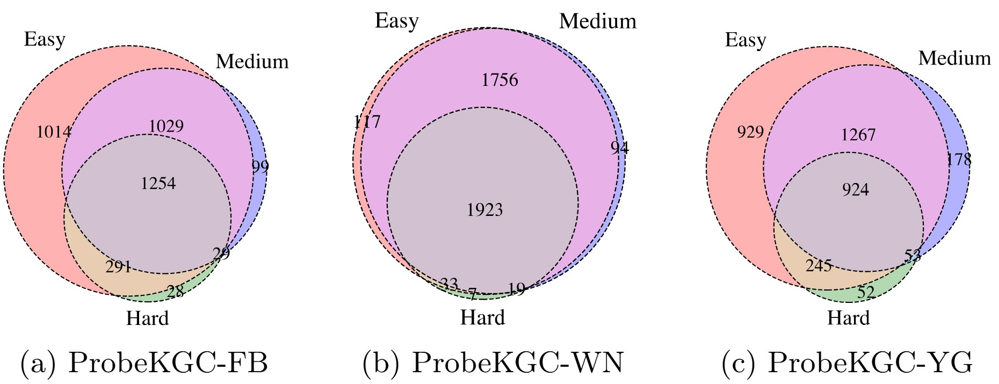

# Are LLMs Really Knowledgeable for Knowledge Graph Completion?

> Knowledge Graph (KG) completion aims to infer new facts from existing knowledge. While recent efforts have explored leveraging large language models (LLMs) for this task, it remains unclear whether LLMs truly understand KG facts or how they utilize such knowledge in reasoning. In this work, we investigate these questions by proposing ProbeKGC, a benchmark dataset that reformulates KG completion as multiple-choice question answering with systematically controlled option difficulties. Empirical results show that LLMs often produce inconsistent answers when the same question is presented with varying distractor difficulty, suggesting a reliance on shallow reasoning such as elimination rather than genuine knowledge recall. To better quantify model confidence and knowledge grasp, we introduce Normalized Knowledge Divergence (NKD), a novel metric that complements accuracy by capturing distributional confidence in answer selection. We further analyze the influence of selection biases on LLM predictions and highlight that LLMs do not always fully exploit their stored knowledge. Finally, we evaluate three enhancement strategies and provide insights into potential directions for improving KG completion.

## Table of contents

1. [Dataset](#Dataset)
   1. [Overview](#overview)
   2. [Option Design](#Option)
   2. [Statistics](#Statistics)
   4. [Description](#Description)
2. [Evaluation and Analysis]()
   1. [Answer Consistency Evaluation](#Consistency)
   2. [Answer Confidence Quantification](#Confidence)
   3. [Knowledge Utilization Analysis](#Utilization)
   4. [Knowledge Enhancement Evaluation](#Enhancement)
3. [Code](#Code)
   1. [Description](#code_des)
   2. [Dependencies](#Dependencies)
   3. [Usage](#Usage)

## <h2 id='Dataset'>Dataset</h2>

The dataset can be downloaded from [here](https://drive.google.com/file/d/1fUfUsq7gQ3zhNZe1ZXRqD1PNOt9M3nWy/view?usp=drive_link). Extract it to the project root directory to use.

### <h3 id='overview'>Overview</h3>

We construct ProbeKGC based on three widely-used KG completion benchmark datasets: `FB15K237`, `WN18RR`, and `YAGO3-10`.
The statistics of these datasets are shown as follows:
| Datasets | #Entities | #Relations | #Training | #Validation | #Testing |
| :- | -: | -: | -: | -: | -: |
| FB15K237 | 14,541 | 237 | 272,115 | 17,535 | 20,466 |
| WN18RR | 40,943 | 11 | 86,835 | 3,034 | 3,134 |
| YAGO3-10 | 123,182 | 37 | 1,079,040 | 5,000 | 5,000 |

We randomly sample 2,000 test triplets from each dataset, producing three corresponding datasets: `ProbeKGC-FB`, `ProbeKGC-WN`, and `ProbeKGC-YG`. 
For each test triplet, we generate two KG completion queries: one for head entity prediction and one for tail entity prediction.
For each query, we design three sets of options corresponding to different option difficulty levels, and shuffle the options to avoid ranking bias.
We then convert each query and its four options into a natural language multi-choice question.
We ensure that each question contains exactly one correct answer among the four options, making it unambiguous and answerable.  

### <h3 id='Option'>Option Design</h3>

ProbeKGC includes three levels of option difficulty, each based on a different strategy for constructing distractors:
- **Easy**: Distractors are randomly sampled from the entire set of entities in the KG. 
- **Medium**: Distractors are sampled from entities of the same relation and type as the answer, based on relation semantics (i.e., the target entity types).
- **Hard**: Distractors are top-ranked entities semantically similar to the correct answer, selected using TransE embeddings.


### <h3 id='Statistics'>Statistics</h3>

The statistics of ProbeKGC are shown below.  

| Dataset        | Difficulty | #Entities | #Relations | #Triples | #Options | #Answer Type |
|----------------|------------|-----------:|------------:|----------:|----------:|---------------|
|                | Easy       | 9,427      | 161         | 2,000     | 4         | A/B/C/D       |
| **ProbeKGC-FB**    | Medium     | 7,753      | 161         | 2,000     | 4         | A/B/C/D       |
|                | Hard       | 5,940      | 161         | 2,000     | 4         | A/B/C/D       |
|                | Easy       | 13,028     | 11          | 2,000     | 4         | A/B/C/D       |
| **ProbeKGC-WN**    | Medium     | 12,257     | 11          | 2,000     | 4         | A/B/C/D       |
|                | Hard       | 10,981     | 11          | 2,000     | 4         | A/B/C/D       |
|                | Easy       | 14,686     | 30          | 2,000     | 4         | A/B/C/D       |
| **ProbeKGC-YG**    | Medium     | 13,831     | 30          | 2,000     | 4         | A/B/C/D       |
|                | Hard       | 11,109     | 30          | 2,000     | 4         | A/B/C/D       |


### <h3 id='Description'>Description</h3>

We take `ProbeKGC-FB` as an example to introduce the files in each dataset. The directory structure of each dataset is listed as follows:

```
ProbeKGC-FB/
├── entity.json: names and descriptions of entities
├── relation.json: statement templates for relations
├── train.txt: training triples
├── valid.txt: validation triples
├── test.txt: testing triples
├── test_simple.json: multi-choice questions with easy-level distractors
├── test_medium.json: multi-choice questions with medium-level distractors
├── test_hard.json: multi-choice questions with herd-level distractors
```


## <h2 id='Evaluation'>Evaluation and Analysis</h2>

### <h3 id='Consistency'>Answer Consistency Evaluation</h3>
We report the accuracy for different LLMs on ProbeKGC.
We find thatLLMs may not truly grasp the knowl-
edge of the questions, through the inconsistent answers of LLMs across different
option difficulties. LLMs heavily rely on shallow reasoning like the elimination
strategy. 

<div align="center">Accuracy for different LLMs on ProbeKGC.</div>


<div align="center">The overlap of correctly answered questions using
GPT-3.5 Turbo.</div>


<div align="center">The overlap of correctly answered questions using
GPT-4o mini.</div>


<div align="center">The overlap of correctly answered questions using
LLaMA3.1-8B Turbo.</div>


<div align="center">The overlap of correctly answered questions using
LLaMA3.1-70B Turbo.</div>


<div align="center">The overlap of correctly answered questions using
Qwen2.5-7B Turbo.</div>



<div align="center">The overlap of correctly answered questions using
Qwen2.5-72B Turbo.</div>


### <h3 id='Confidence'>Answer Confidence Quantification</h3>
We report the NKD results for different LLMs on ProbeKGC.
We find that our NKD metric shows significant
differences, even though the accuracy of different LLMs is similar. 
This indicates that NKD can better reflect the different levels of knowledge grasp in LLMs
compared to accuracy. 
LLM confidence is associated with their model-families and model sizes, and they are confident on both long-tail and popular entities.


<div align="center">NKD of different LLMs with different option difficulty levels.</div>


<div align="center">Accuracy vs NKD on ProbeKGC-FB.</div>


<div align="center">Accuracy vs NKD on ProbeKGC-WN.</div>


<div align="center">Accuracy vs NKD on ProbeKGC-YG.</div>


### <h3 id='Utilization'>Knowledge Utilization Analysis</h3>

We move the gold answer of each question to every option position, creating four multiple-choice questions for LLMs to answer. 
We report the accuracy and NKD results of different LLMs on ProbeKGC.
We find that most LLMs tend to choose “A” or “B”, indicating that LLMs might not fully leverage their knowledge for KG completion. 
Their choices are significantly influenced by the selection bias, and this bias is different from that observed in general domain reasoning. 
NKD is more robust than accuracy against such bias.

<div align="center">Performance w.r.t. option position bias on ProbeKGC-FB.</div>


<div align="center">Performance w.r.t. option position bias on ProbeKGC-WN.</div>


<div align="center">Performance w.r.t. option position bias on ProbeKGC-YG.</div>


### <h3 id='Enhancement'>Knowledge Enhancement Evaluation</h3>

We explore ways to improve LLMs' performance on KG completion.
We find that RAG and CoT offer complementary strengths in KG completion, depending on the characteristics of the target KG. 
CoT is particularly effective for reasoning over complex relations, while RAG excels in supplementing external knowledge. 
When enhancing LLMs with a specific strategy, it is essential to consider the characteristics of the KG.

<div align="center">Accuracy of different enhancement strategies.</div>


## <h2 id='Code'>Code</h2>

### <h3 id='code_des'>Description</h3>

Folder "code" contains codes to reproduce our evaluation and analysis.
The directory structure is listed as follows:

```
ProbeKGC-FB/
├── accuracy.py: compute accuracy when using CoT
├── accuracy.py: compute accuracy and NKD score
├── chat_api.py: set your own API keys here
├── knowledge_graph.py: load the data of entities, relations, and the graph
├── main.py: answer the multi-choice questions via commercial APIs
├── main_open.py: answer the multi-choice questions via open-source LLMs when using CoT
├── main_open.py: answer the multi-choice questions via open-source LLMs
├── prompt_hub.py: define the prompt template
```

### <h3 id='Dependencies'>Dependencies</h3>

- Python=3.10.15
- ccelerate==1.1.1
- bitsandbytes==0.45.0
- fire==0.7.0
- matplotlib==3.10.0
- matplotlib-venn==1.1.1
- numpy==1.26.4
- openai==1.56.0
- peft==0.14.0
- scikit-learn==1.6.1
- torch==2.5.1
- transformers==4.45.2
- vllm==0.6.4

### <h3 id='Usage'>Usage</h3>
Definition of all hyper-parameters can be found in the corresponding code.

#### Obtain accuracy and NKD scores
For commercial APIs:
```
python main_api.py --dataset {ProbeKGC-FB} --data_mode {simple} --api_mode {gpt-4o-mini} --run_name {run_test}
```

For open-source LLMs:
```
python main_open.py --dataset {ProbeKGC-FB} --model_name {llama3.1-8b} --data_mode {simple} --run_name {run_test}
```

After calling LLMs, compute accuracy and NKD score:
```
python accuracy.py --dataset {ProbeKGC-FB} --data_model {simple} --run_name {run_test}
```

#### Bias Evaluation
For commercial APIs
```
python main_api.py --dataset {ProbeKGC-FB} --data_mode {simple} --api_mode {gpt-4o-mini} --run_name {run_test} --fixed_option_id {A}
```

answer the multi-choice questions with open-source LLMs
```
python main_open.py --dataset {ProbeKGC-FB} --model_name {llama3.1-8b} --data_mode {simple} --run_name {run_test} --fixed_option_id {A}
```

After calling LLMs, compute accuracy and NKD score:
```
python accuracy.py --dataset {ProbeKGC-FB} --data_model {simple} --run_name {run_test}
```

#### Knowledge Enhancement Evaluation
For commercial APIs
```
python main_api.py --dataset {ProbeKGC-FB} --data_mode {simple} --api_mode {gpt-4o-mini} --run_name {run_test} --logprobs {False}
```

answer the multi-choice questions with open-source LLMs
```
python main_open_cot.py --dataset {ProbeKGC-FB} --model_name {llama3.1-8b} --data_mode {simple} --run_name {run_test} 
```

After calling LLMs, compute accuracy and NKD score:
```
python accuracy_cot.py --dataset {ProbeKGC-FB} --data_model {simple} --run_name {run_test}
```